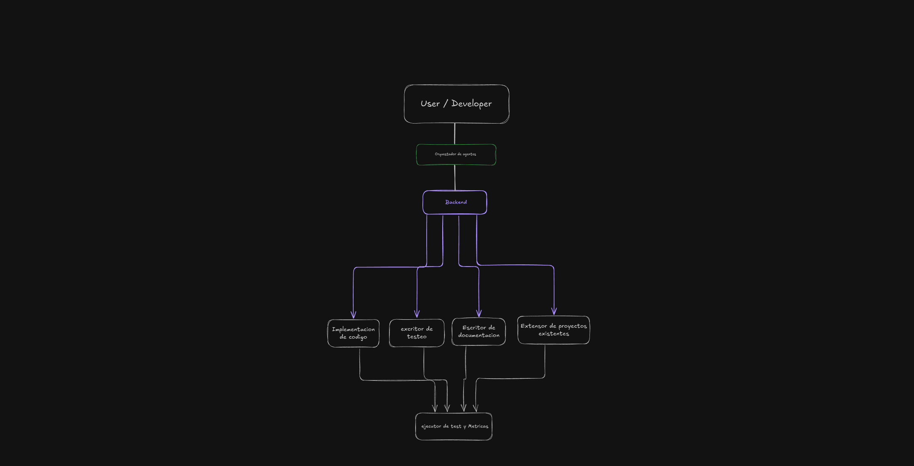

# Custom Agents Config 

## Agente Orquestador para proyectos backend (Node.js/ts)

Este repositorio contiene la configuración personalizada para los agentes de [OpenCode](https://opencode.ai) y sus respectivos prompts, organizados para proveer subagentes especializados (`backend`, `write-code`, `write-test`, `write-doc`, `extend-project`).

El objetivo es compartir un entorno de inteligencia artificial estandarizado y reproducible para cualquier usuario de la organización o comunidad.




## Requisitos Previos

Antes de configurar este proyecto en un entorno nuevo, asegúrate de tener instalado:

1. **Node.js (v22+) y npm / npx**: Varios MCP Servers usados (como `@nekzus/mcp-server` o `@modelcontextprotocol/server-filesystem`) requerirán `npx` para ejecutarse.
2. **Python y uv / uvx**: Necesarios para el MCP `cli-mcp-server` encargado de la ejecución segura de ciertos comandos bash.
3. **OpenCode**: Asegúrate de tener la app u la herramienta principal desde donde interactúas con los agentes base instalada.

## Instalación y Configuración

Sigue estos pasos para duplicar este espacio de trabajo en cualquier equipo:

1. **Clonar este repositorio** dentro del directorio de configuración de OpenCode local home/.config/opencode:

   ```bash
   git clone https://github.com/Joel-RD/opencode-custom-agents.git
   ```

2. **Copiar carpetas** dentro de la raiz de home/.config/opencode

 - desing
 - prompt-agent

## Servidores MCP y Tools Soportados

Este perfil se beneficia del protocolo de contexto modelo (MCP) activando integraciones vitales en la máquina local (`enabled: true` o preparadas para uso):

- **systemFile** (`@modelcontextprotocol/server-filesystem`): Expone carpetas específicas de forma segura para permitir a los agentes interactuar con el sistema.
- **npmAnalyzer** (`@nekzus/mcp-server`): Herramientas para analizar paquetes del ecosistema de JavaScript / NPM y sugerir integraciones.
- **pencil** (Vía Extensiones): Herramientas de visual layout y UI rendering (`.pen`) para interacciones relativas a diseño.
- **cli_MCP** (`cli-mcp-server`): *(Por default desactivado en la configuración).* Funciones para ejecutar comandos específicos delimitados de terminal (ej: `ls`, `cat`, `grep`, `pwd`) para diagnóstico si lo necesitas más tarde.

## Estructura de Sub-Agentes

Este proyecto incluye una estricta especialización de responsabilidades:

1. **orchestrator**: Actúa como el modelo `primary`. Analiza el objetivo, dialoga con el usuario y luego solo transfiere control o solicitudes al subagente `backend`. Carece de permisos excesivos de edición del OS (Modo Seguro).
2. **backend**: Un sub-agente estratega escondido del usuario (`hidden: true`) capaz de usar terminal con bash en modo lectura o lectura de estado. Decide asignar trabajo a expertos específicos.
3. **write-code**: Especialista en escritura o estructuración de código.
4. **write-test**: Dedicado completamente a diseñar, escribir y perfeccionar código de tests para tu aplicación.
5. **write-doc**: Maneja lo correspondiente a mantenimiento de READMEs, docstrings y explicaciones.
6. **extend-project**: Herramienta general de extensión integral del proyecto o de módulos transversales.

